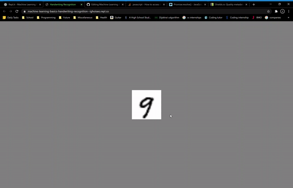

## Machine Learning Basics: Handwriting Recognition

>A proprietary Machine Learning Library I made for me to use in my future personal projects.
I learned a lot about ML, parsing through external training data, object oriented programming, async functions and more.

